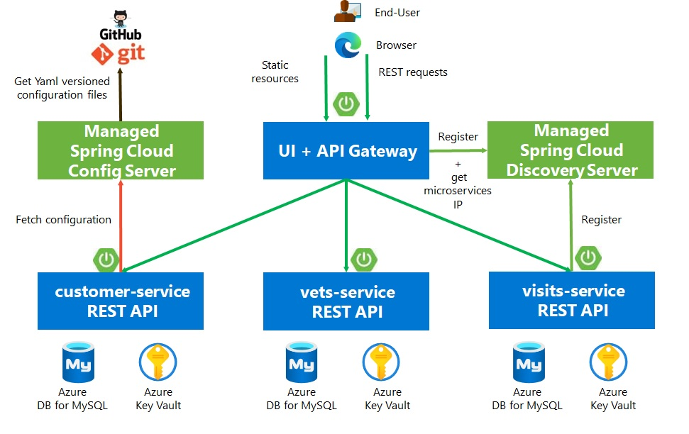

# Deploy Spring Boot apps using Azure Spring Apps and MySQL 

[](https://github.com/ezYakaEagle442//azure-spring-apps-petclinic-mic-srv/actions/workflows/deploy-iac-pre-req.yml)
[](https://opensource.org/licenses/Apache-2.0)

[](https://github.com/ezYakaEagle442//azure-spring-apps-petclinic-mic-srv/actions/workflows/deploy-iac.yml)
[](https://opensource.org/licenses/Apache-2.0)

[](https://github.com/ezYakaEagle442/azure-spring-apps-petclinic-mic-srv/actions/workflows/maven-build.yml)
[](https://opensource.org/licenses/Apache-2.0)

[](https://github.com/ezYakaEagle442/azure-spring-apps-petclinic-mic-srv/actions/workflows/maven-build-ui.yml)
[](https://opensource.org/licenses/Apache-2.0)

[](https://github.com/ezYakaEagle442/azure-spring-apps-petclinic-mic-srv/actions/workflows/build-deploy-apps-staging-CLI.yml)
[](https://opensource.org/licenses/Apache-2.0)

[](https://github.com/ezYakaEagle442/azure-spring-apps-petclinic-mic-srv/actions/workflows/build-deploy-apps-prod-CLI.yml)
[](https://opensource.org/licenses/Apache-2.0)

[](https://github.com/ezYakaEagle442/azure-spring-apps-petclinic-mic-srv/actions/workflows/build-deploy-ui-staging-CLI.yml)
[](https://opensource.org/licenses/Apache-2.0)

[](https://github.com/ezYakaEagle442/azure-spring-apps-petclinic-mic-srv/actions/workflows/build-deploy-ui-prod-CLI.yml)
[](https://opensource.org/licenses/Apache-2.0)

Azure Spring Apps enables you to easily run a Spring Boot applications on Azure.

This quickstart shows you how to deploy an existing Java Spring Apps application to Azure. 
When you're finished, you can continue to manage the application via the Azure CLI or switch to using the 
Azure Portal.

This microservices sample was initially derived from [AngularJS version](https://github.com/spring-petclinic/spring-petclinic-angular1) to demonstrate how to split sample Spring application into [microservices](http://www.martinfowler.com/articles/microservices.html).
To achieve that goal we use IaC with Azure Bicep, MS build of OpenJDK 11, GitHub Actions, Azure Springs Apps, Azure Key Vault, Azure Database for MySQL (Flexible server) and Azure BLOB storage to store the *.jar Artifacts


* [Deploy Spring Boot apps using Azure Spring Apps and MySQL](#deploy-spring-boot-apps-using-azure-spring-apps-and-mysql)
  * [What will you experience](#what-will-you-experience)
  * [What you will need](#what-you-will-need)
  * [Install the Azure CLI extension](#install-the-azure-cli-extension)
  * [Clone and build the repo](#clone-and-build-the-repo)
  * [Understanding the Spring Petclinic application](#understanding-the-Spring-Petclinic-application)
  * [Unit 1 - AUTOMATE Infra deployments using GitHub Actions](#deploy-azure-spring-apps-instance-with-iac)
  * [Unit 2 - AUTOMATE Apps deployments using GitHub Actions](#deploy-the-petclinic-microservices-apps-with-iac)
  * [Unit 3 - Deploy and monitor Spring Boot apps](#monitor-spring-boot-applications)
  * [Unit 4 - Delete Passwords](#delete-passwords)


 Read:

 - [https://aka.ms/Delete-Passwords](https://aka.ms/Delete-Passwords) 
 - [https://techcommunity.microsoft.com/t5/apps-on-azure-blog/delete-passwords-passwordless-connections-for-java-apps-to-azure/ba-p/3638714](https://techcommunity.microsoft.com/t5/apps-on-azure-blog/delete-passwords-passwordless-connections-for-java-apps-to-azure/ba-p/3638714) 
 - [Delete password migration docs](https://learn.microsoft.com/en-us/azure/developer/java/spring-framework/migrate-mysql-to-passwordless-connection?toc=%2Fazure%2Fdeveloper%2Fintro%2Ftoc.json&bc=%2Fazure%2Fdeveloper%2Fintro%2Fbreadcrumb%2Ftoc.json&tabs=sign-in-azure-cli%2Cjava%2Capp-service%2Ccontainer-apps-identity) 
 - [http://aka.ms/do-more](http://aka.ms/do-more) 
- [App deployment](https://learn.microsoft.com/en-us/azure/spring-apps/how-to-prepare-app-deployment?tabs=basic-standard-tier&pivots=programming-language-java)
- [the Reference Architecture](https://learn.microsoft.com/en-us/azure/spring-apps/reference-architecture?tabs=azure-spring-standard) 
- [FAQ](https://learn.microsoft.com/en-us/azure/spring-apps/faq?pivots=programming-language-java)


## What will you experience
You will:
- Build existing Spring Boot applications
- Provision an Azure Spring Apps service instance using **[Bicep](./iac/bicep/README.md)**. Check [API breaking changes](https://docs.microsoft.com/en-us/azure/spring-cloud/breaking-changes)
- Deploy applications to Azure
- Bind applications to Azure Database for MySQL
- Open the application
- Monitor applications
- Automate deployments using GitHub Actions
- Manage application secrets using Azure KeyVault

## What you will need

In order to deploy a Java app to cloud, you need  an Azure subscription. If you do not already have an Azure 
subscription, you can activate your  [MSDN subscriber benefits](https://azure.microsoft.com/pricing/member-offers/msdn-benefits-details/) 
or sign up for a  [free Azure account]((https://azure.microsoft.com/free/)).

In addition, you will need the following:

| [Azure CLI version 2.40.0 or higher](https://docs.microsoft.com/cli/azure/install-azure-cli?view=azure-cli-latest) 
| [Java 11](https://learn.microsoft.com/java/openjdk/download)
| [Maven](https://maven.apache.org/download.cgi) 
| [MySQL CLI](https://dev.mysql.com/downloads/shell/)
| [Git](https://git-scm.com/)
| [`jq` utility](https://stedolan.github.io/jq/download/)
|

Note -  The [`jq` utility](https://stedolan.github.io/jq/download/). On Windows, download [this Windows port of JQ](https://github.com/stedolan/jq/releases) and add the following to the `~/.bashrc` file: 
           ```bash
           alias jq=<JQ Download location>/jq-win64.exe
           ```

Note - The Bash shell. While Azure CLI should behave identically on all environments, shell  semantics vary. Therefore, only bash can be used with the commands in this repo. 
To complete these repo steps on Windows, use Git Bash that accompanies the Windows distribution of 
Git. Use only Git Bash to complete this training on Windows. Do not use WSL.

To install Azure Bicep locally, read [https://learn.microsoft.com/en-us/azure/azure-resource-manager/bicep/install](https://learn.microsoft.com/en-us/azure/azure-resource-manager/bicep/install)

See the [pre-requisites](https://learn.microsoft.com/en-us/azure/spring-apps/quickstart?tabs=Azure-CLI#prerequisites), [Bicep pre-req](https://learn.microsoft.com/en-us/azure/spring-apps/quickstart-deploy-infrastructure-vnet-bicep?tabs=azure-spring-apps-standard#prerequisites) in the ASA docs


### OR Use Azure Cloud Shell

Or, you can use the Azure Cloud Shell. Azure hosts Azure Cloud Shell, an interactive shell  environment that you can use through your browser. You can use the Bash with Cloud Shell  to work with Azure services. You can use the Cloud Shell pre-installed commands to run the  code in this README without having to install anything on your local environment. 

To start Azure Cloud Shell: go to [https://shell.azure.com](https://shell.azure.com), or select the Launch Cloud Shell button to open Cloud Shell in your browser.

To run the code in this article in Azure Cloud Shell:

1. Start Cloud Shell.

1. Select the Copy button on a code block to copy the code.

1. Paste the code into the Cloud Shell session by selecting Ctrl+Shift+V on Windows and Linux or by selecting Cmd+Shift+V on macOS.

1. Select Enter to run the code.

### Install the Azure CLI extension

Install the Azure Spring Apps extension for the Azure CLI using the following command

```bash
    az extension add --name spring
```
Note - `spring` CLI extension `1.1.2` or later is a pre-requisite to enable the
latest Java in-process agent for Application Insights. If you already 
have the CLI extension, you may need to upgrade to the latest

```bash
    az extension update --name spring
```

## Clone and build the repo

### Create a new folder and clone the sample app repository to your Azure Cloud account  

```bash
    mkdir source-code
    git clone https://github.com/ezYakaEagle442/azure-spring-apps-petclinic-mic-srv
```

### Change directory and build the project with Maven

TODO: add ASA Maven Plugin [https://github.com/microsoft/azure-maven-plugins/wiki/Azure-Spring-Apps:-Deploy](https://github.com/microsoft/azure-maven-plugins/wiki/Azure-Spring-Apps:-Deploy)

<span style="color:red">**/!\ IMPORTANT WARNING: projects must be built with -Denv=cloud EXCEPT for api-gateway**</span>

```bash
    cd azure-spring-apps-petclinic-mic-srv
    mvn clean package -DskipTests -Denv=cloud
```
This will take a few minutes.


## Understanding the Spring Petclinic application



The UI code is located at spring-petclinic-api-gateway\src\main\resources\static\scripts.

The Spring Zuul(Netflix Intelligent Routing) config at https://github.com/ezYakaEagle442/spring-petclinic-microservices-config/blob/main/api-gateway.yml has been deprecated and replaced by the Spring Cloud Gateway.

The Spring Cloud Gateway routing is configured at [spring-petclinic-api-gateway/src/main/resources/application.yml](spring-petclinic-api-gateway/src/main/resources/application.yml)

The API Gateway Controller is located at [spring-petclinic-api-gateway/src/main/java/org/springframework/samples/petclinic/api/boundary/web/ApiGatewayController.java](spring-petclinic-api-gateway/src/main/java/org/springframework/samples/petclinic/api/boundary/web/ApiGatewayController.java)

Note: The Spring Cloud Discovery Server is NOT deployed as it is a managed service in ASA.
see :
- [https://spring.io/guides/gs/service-registration-and-discovery](https://spring.io/guides/gs/service-registration-and-discovery/)
- [https://spring.io/projects/spring-cloud-netflix](https://spring.io/projects/spring-cloud-netflix)
- [https://kubernetes.io/docs/tasks/administer-cluster/dns-debugging-resolutionhttps://kubernetes.io/docs/tasks/administer-cluster/dns-debugging-resolution/
- [https://kubernetes.io/docs/concepts/services-networking/dns-pod-service/](https://kubernetes.io/docs/concepts/services-networking/dns-pod-service/)


### Understand the Spring Cloud Config

Read [https://learn.microsoft.com/en-us/azure/spring-apps/quickstart-setup-config-server?tabs=Azure-portal&pivots=programming-language-java](https://learn.microsoft.com/en-us/azure/spring-apps/quickstart-setup-config-server?tabs=Azure-portal&pivots=programming-language-java)

Spring Boot is a framework aimed to help developers to easily create and build stand-alone, production-grade Spring based Applications that you can “just run”.

Spring Cloud Config provides server and client-side support for externalized configuration in a distributed system. With the Spring Cloud Config Server you have a central place to manage external properties for applications across all environments.

Spring Cloud Config Server is a centralized service that via HTTP provides all the applications configuration (name-value pairs or equivalent YAML content). The server is embeddable in a Spring Boot application, by using the @EnableConfigServer annotation.

In other words, the Spring Cloud Config Server is simply a Spring Boot application, configured as a Spring Cloud Config Server, and that is able to retrieve the properties from the configured property source. The property source can be a Git repository, svn or Consul service. 

A Spring Boot application properly configured, can take immediate advantage of the Spring Config Server. It also picks up some additional useful features related to Environment change events. Any Spring Boot application can easily be configured as a Spring Cloud Config Client.

### Understand the Spring Cloud Discovery Server
see :
- [https://spring.io/guides/gs/service-registration-and-discovery](https://spring.io/guides/gs/service-registration-and-discovery/)
- [https://spring.io/projects/spring-cloud-netflix](https://spring.io/projects/spring-cloud-netflix)

Spring Cloud Netflix provides Netflix OSS integrations for Spring Boot apps through autoconfiguration and binding to the Spring Environment and other Spring programming model idioms. With a few simple annotations, you can quickly enable and configure the common patterns inside your application and build large distributed systems with battle-tested Netflix components. The patterns provided include Service Discovery (Eureka).

Features
Spring Cloud Netflix features:
- Service Discovery: Eureka instances can be registered and clients can discover the instances using Spring-managed beans
- Service Discovery: an embedded Eureka server can be created with declarative Java configuration


## Deploy Azure Spring Apps instance with IaC

See **[Bicep](./iac/bicep/README.md)**

<span style="color:red">**Be aware that the MySQL DB is NOT deployed in a VNet but network FireWall Rules are Set. So ensure to allow ASA Outbound IP addresses or check the option "Allow public access from any Azure service within Azure to this server" in the Azure Portal / your MySQL DB / Networking / Firewall rules**</span>

Read :
- [https://docs.github.com/en/actions/using-workflows/storing-workflow-data-as-artifacts](https://docs.github.com/en/actions/using-workflows/storing-workflow-data-as-artifacts)
- [https://docs.github.com/en/actions/automating-builds-and-tests/building-and-testing-java-with-maven](https://docs.github.com/en/actions/automating-builds-and-tests/building-and-testing-java-with-maven)

You have to specify all [KV secrets](./iac/bicep/modules/kv/kv_sec_key.bicep#L25) that will be then created in the GitHub Action [Azure Infra pre-req workflow](./.github/workflows/deploy-iac.yml#L63) :
- SPRING-DATASOURCE-PASSWORD
- SPRING-CLOUD-AZURE-KEY-VAULT-ENDPOINT
- SPRING-CLOUD-AZURE-TENANT-ID
- VM-ADMIN-USER-NAME
- VM-ADMIN-PASSWORD

dash '-' are not supported in GH secrets, so the secrets must be named in GH with underscore '_'.
Also the '&' character in the SPRING_DATASOURCE_URL must be escaped with '\&'

Add the App secrets used by the Spring Config to your GH repo settings / Actions / secrets / Actions secrets / New Repository secrets / Add , ex: [https://github.com/ezYakaEagle442/azure-spring-apps-petclinic-mic-srv/settings/secrets/actions](https://github.com/ezYakaEagle442/azure-spring-apps-petclinic-mic-srv/settings/secrets/actions):

Secret Name	| Secret Value example
-------------:|:-------:
SPRING_DATASOURCE_URL | jdbc:mysql://petcliasa777.mysql.database.azure.com:3306/petclinic?useSSL=true\&requireSSL=true\&enabledTLSProtocols=TLSv1.2\&verifyServerCertificate=true
SPRING_DATASOURCE_PASSWORD | PUT YOUR PASSWORD HERE
SPRING_CLOUD_AZURE_KEY_VAULT_ENDPOINT | https://kv-petclinic777.vault.azure.net/
SPRING_CLOUD_AZURE_TENANT_ID | PUT YOUR AZURE TENANT ID HERE
VM_ADMIN_USER_NAME | PUT YOUR AZURE Windows client VM JumpOff Admin User Name HERE
VM_ADMIN_PASSWORD | PUT YOUR PASSWORD HERE

```bash
LOCATION="westeurope"
RG_KV="rg-iac-kv777"
RG_APP="rg-iac-asa-petclinic-mic-srv"

az group create --name $RG_KV --location $LOCATION
az group create --name $RG_APP --location $LOCATION
```

A Service Principal is required for GitHub Action Runner, read [https://aka.ms/azadsp-cli](https://aka.ms/azadsp-cli)
```bash  
SPN_APP_NAME="gha_asa_run"

# /!\ In CloudShell, the default subscription is not always the one you thought ...
subName="set here the name of your subscription"
subName=$(az account list --query "[?name=='${subName}'].{name:name}" --output tsv)
echo "subscription Name :" $subName

SUBSCRIPTION_ID=$(az account list --query "[?name=='${subName}'].{id:id}" --output tsv)
SUBSCRIPTION_ID=$(az account show --query id -o tsv)
TENANT_ID=$(az account show --query tenantId -o tsv)
```

Add your AZURE_SUBSCRIPTION_ID, AZURE_TENANT_ID to your GH repo secrets / Actions secrets / Repository secrets

Read [https://learn.microsoft.com/en-us/azure/developer/github/connect-from-azure](https://learn.microsoft.com/en-us/azure/developer/github/connect-from-azure?tabs=azure-cli%2Cwindows#create-a-service-principal-and-add-it-as-a-github-secret)


In the GitHub Action Runner, to allow the Service Principal used to access the Key Vault, execute the command below:
```sh
# SPN_PWD=$(az ad sp create-for-rbac --name $SPN_APP_NAME --skip-assignment --query password --output tsv)
az ad sp create-for-rbac --name $SPN_APP_NAME
```

```console
{
  "clientId": "<GUID>",
  "clientSecret": "<GUID>",
  "subscriptionId": "<GUID>",
  "tenantId": "<GUID>",
  "activeDirectoryEndpointUrl": "https://login.microsoftonline.com",
  "resourceManagerEndpointUrl": "https://management.azure.com/",
  "activeDirectoryGraphResourceId": "https://graph.windows.net/",
  "sqlManagementEndpointUrl": "https://management.core.windows.net:8443/",
  "galleryEndpointUrl": "https://gallery.azure.com/",
  "managementEndpointUrl": "https://management.core.windows.net/"
}
```

Troubleshoot:
If you hit _["Error: : No subscriptions found for ***."](https://learn.microsoft.com/en-us/answers/questions/738782/no-subscription-found-for-function-during-azure-cl.html)_ , this is related to an IAM privilege in the subscription.

```sh
#APP_ID=$(az ad sp list --all --query "[?appDisplayName=='${SPN_APP_NAME}'].{appId:appId}" --output tsv)
APP_ID=$(az ad sp list --show-mine --query "[?appDisplayName=='${SPN_APP_NAME}'].{id:appId}" --output tsv)
TENANT_ID=$(az ad sp list --show-mine --query "[?appDisplayName=='${SPN_APP_NAME}'].{t:appOwnerOrganizationId}" --output tsv)

# /!\ In Bicep : RBAC ==> GH Runner SPN must have "Storage Blob Data Contributor" Role on the storage Account"
# /!\ The SPN Id is NOT the App Registration Object ID, but the Enterprise Registration Object ID"
SPN_ID=$(az ad sp show --id $APP_ID --query id -o tsv)

# the assignee is an appId
az role assignment create --assignee $APP_ID --scope /subscriptions/${SUBSCRIPTION_ID}/resourceGroups/${RG_KV} --role contributor

# "Key Vault Secrets User"
az role assignment create --assignee $APP_ID --scope /subscriptions/${SUBSCRIPTION_ID}/resourceGroups/${RG_KV} --role 4633458b-17de-408a-b874-0445c86b69e6


# https://learn.microsoft.com/en-us/azure/role-based-access-control/role-assignments-portal#prerequisites
# /!\ To assign Azure roles, you must have: requires to have Microsoft.Authorization/roleAssignments/write and Microsoft.Authorization/roleAssignments/delete permissions, 
# such as User Access Administrator or Owner.
az role assignment create --assignee $APP_ID --scope /subscriptions/${SUBSCRIPTION_ID}/resourceGroups/${RG_KV} --role Owner
az role assignment create --assignee $APP_ID --scope /subscriptions/${SUBSCRIPTION_ID}/resourceGroups/${RG_APP} --role Owner

az role assignment create --assignee $APP_ID --scope /subscriptions/${SUBSCRIPTION_ID}/resourceGroups/${RG_APP} --role contributor
```

<span style="color:red">**RBAC Permission model is set on KV, the [pre-req](https://learn.microsoft.com/en-us/azure/key-vault/general/rbac-guide?tabs=azure-cli#prerequisites) requires to have Microsoft.Authorization/roleAssignments/write and Microsoft.Authorization/roleAssignments/delete permissions, such as User Access Administrator or Owner.

[https://learn.microsoft.com/en-us/azure/role-based-access-control/role-assignments-portal#prerequisites](https://learn.microsoft.com/en-us/azure/role-based-access-control/role-assignments-portal#prerequisites)
To assign Azure roles, you must have: requires to have Microsoft.Authorization/roleAssignments/write and Microsoft.Authorization/roleAssignments/delete permissions, such as User Access Administrator or Owner.
**</span>

<span style="color:red">**"Key Vault Secrets User" [built-in role](https://learn.microsoft.com/en-us/azure/key-vault/general/rbac-guide?tabs=azure-cli#azure-built-in-roles-for-key-vault-data-plane-operations) read secret contents including secret portion of a certificate with private key. Only works for key vaults that use the 'Azure role-based access control' permission model.**
</span>

Read :
- [Use GitHub Actions to connect to Azure documentation](https://docs.microsoft.com/en-us/azure/developer/github/connect-from-azure?tabs=azure-portal%2Cwindows).
- [https://github.com/Azure/login#configure-a-service-principal-with-a-secret](https://github.com/Azure/login#configure-a-service-principal-with-a-secret)

Paste in your JSON object for your service principal with the name **AZURE_CREDENTIALS** as secrets to your GH repo secrets / Actions secrets / Repository secrets.

You can test your connection with CLI :
```sh
az login --service-principal -u $APP_ID -p $SPN_PWD --tenant $TENANT_ID
```

Add SUBSCRIPTION_ID, TENANT_ID, APP_ID, SPN_ID, and SPN_PWD as secrets to your GH repo secrets / Actions secrets / Repository secrets

<span style="color:red">**Be aware that at this stage KV is not created yet, it must exist first to set-policy**
[enableRbasauthorization is true in KV](./iac/bicep/modules/kv/kv.bicep#L61), the key vault will use RBAC for authorization of data actions, and the [access policies specified in vault properties](https://docs.microsoft.com/en-us/azure/templates/microsoft.keyvault/vaults/accesspolicies?tabs=bicep) will be ignored</span>

If enableRbasauthorization was set to false, you would have to follow the here under step to add access policy for the Service Principal.
```sh
KV_NAME="kv-petcliasa42"
az keyvault set-policy -n $KV_NAME --secret-permissions get list --spn $APP_ID
```

See the GitHub Workflows :
- [Deploy the Azure Infra pre-req services workflow](./.github/workflows/deploy-iac-pre-req.yml)
- [Deploy the Azure Infra services workflow](./.github/workflows/deploy-iac.yml)
- [Maven Backends Build workflow](./.github/workflows/maven-build.yml)
- [Maven UI Build workflow](./.github/workflows/maven-build-ui.yml)
- [Java Apps Backends to Staging Deployment workflow](./.github/workflows/build-deploy-apps-staging-CLI.yml)
- [Java Apps Backends to Production Deployment workflow](./.github/workflows/build-deploy-apps-prod-CLI.yml)
- [Java Apps UI to Staging Deployment workflow](./.github/workflows/build-deploy-ui-staging-CLI.yml)
- [Java Apps UI to Staging Production workflow](./.github/workflows/build-deploy-ui-prod-CLI.yml)
- [Delete ALL the Azure Infra services workflow, except KeyVault](./.github/workflows/delete-rg.yml)


The Workflow run the steps in this in this order :

```
├── Deploy the Azure Infra services workflow ./.github/workflows/deploy-iac.yml
│   ├── Authorize local IP to access the Azure Key Vault ./.github/workflows/deploy-iac.yml#L143
│   ├── Create the secrets ./.github/workflows/deploy-iac.yml#L150
│   ├── Disable local IP access to the Key Vault ./.github/workflows/deploy-iac.yml#L262
│   ├── Deploy the pre-req ./.github/workflows/deploy-iac.yml#L295
│   ├── Whitelist asa Env. OutboundIP to KV and MySQL ./.github/workflows/deploy-iac.yml#L322
│   ├── Call Maven Build ./.github/workflows/deploy-iac.yml#L369
│       ├── Maven Build ./.github/workflows/maven-build.yml#L128
│       ├── Publish the Maven package ./.github/workflows/maven-build.yml#L166
│       ├── Check all Jar artifacts ./.github/workflows/maven-build.yml#L177
│       ├── Build image and push it to ACR ./.github/workflows/maven-build.yml#L200
│   ├── Call Maven Build-UI ./.github/workflows/deploy-iac.yml#L376
│   ├── Deploy Backend Services ./.github/workflows/deploy-iac.yml#L382
│       ├── Deploy Backend services calling iac/bicep/petclinic-apps.bicep
│       ├── Deploy the UI calling iac/bicep/modules/asa/apps/asa-ui.bicep
│   ├── Configure Diagnostic-Settings ./.github/workflows/deploy-iac.yml#L453
│   ├── Configure GitHub-Action-Settings ./.github/workflows/deploy-iac.yml#460
```

You need to set your own param values in each Workflow.

Note: 
- In the GH workflow / Job ,  runs-on: ubuntu-latest ==> ubuntu-latest is currently transitioning to ubuntu-22.04. During this time, you may experience some jobs running on either an ubuntu-20.04 or ubuntu-22.04 runner. You can specify runs-on: ubuntu-20.04 in your workflow if you need the previous version. Details can be found in this [announcement](https://github.com/actions/runner-images/issues/6399).
- the GH Hosted Runner / [Ubuntu latest image has already Azure CLI installed](https://github.com/actions/runner-images/blob/main/images/linux/Ubuntu2204-Readme.md#cli-tools)


## Deploy the petclinic microservices Apps with IaC

Workflow Design

The Workflow run the steps in this in this order :

```
├── Deploy the Azure Infra services workflow ./.github/workflows/deploy-iac.yml
│   ├── Authorize local IP to access the Azure Key Vault ./.github/workflows/deploy-iac.yml#L143
│   ├── Create the secrets ./.github/workflows/deploy-iac.yml#L150
│   ├── Disable local IP access to the Key Vault ./.github/workflows/deploy-iac.yml#L262
│   ├── Deploy the pre-req ./.github/workflows/deploy-iac.yml#L295
│   ├── Whitelist asa Env. OutboundIP to KV and MySQL ./.github/workflows/deploy-iac.yml#L322
│   ├── Call Maven Build ./.github/workflows/deploy-iac.yml#L369
│       ├── Maven Build ./.github/workflows/maven-build.yml#L128
│       ├── Publish the Maven package ./.github/workflows/maven-build.yml#L166
│       ├── Check all Jar artifacts ./.github/workflows/maven-build.yml#L177
│       ├── Build image and push it to ACR ./.github/workflows/maven-build.yml#L200
│   ├── Call Maven Build-UI ./.github/workflows/deploy-iac.yml#L376
│   ├── Deploy Backend Services ./.github/workflows/deploy-iac.yml#L382
│       ├── Deploy Backend services calling iac/bicep/petclinic-apps.bicep
│       ├── Deploy the UI calling iac/bicep/modules/asa/apps/asa-ui.bicep
│   ├── Configure Diagnostic-Settings ./.github/workflows/deploy-iac.yml#L453
│   ├── Configure GitHub-Action-Settings ./.github/workflows/deploy-iac.yml#460
```

You need to set your own param values in each Workflow.


## Database configuration

In its default configuration, Petclinic uses an in-memory database (HSQLDB) which gets populated at startup with data.
A similar setup is provided for MySql in case a persistent database configuration is needed.
Dependency for Connector/J, the MySQL JDBC driver is already included in the `pom.xml` files.


### Set MySql connection String

You need to reconfigure the MySQL connection string with your own settings (you can get it from the Azure portal / petcliaks-mysql-server / Connection strings / JDBC):
In the [spring-petclinic-microservices-config/blob/main/application.yml](https://github.com/ezYakaEagle442/spring-petclinic-microservices-config/blob/main/application.yml) :
```
spring:
  config:
    activate:
      on-profile: mysql
  datasource:
    schema: classpath*:db/mysql/schema.sql
    data: classpath*:db/mysql/data.sql
    url: jdbc:mysql://petcliasa.mysql.database.azure.com:3306/petclinic?useSSL=true&requireSSL=true&enabledTLSProtocols=TLSv1.2&verifyServerCertificate=true

    # url: jdbc:mysql://localhost:3306/petclinic?useSSL=false
    # https://learn.spring.io/spring-boot/docs/2.7.3/reference/html/application-properties.html#appendix.application-properties.data
    
    # spring.datasource.password will be automatically injected from KV secrets SPRING-DATASOURCE-PASSWORD
    # username: ${SPRING-DATASOURCE-USERNAME}
    # password: ${SPRING-DATASOURCE-PASSWORD}  
    initialization-mode: NEVER # ALWAYS
    # https://javabydeveloper.com/spring-boot-loading-initial-data/
    platform: mysql
    #driver-class-name: com.mysql.jdbc.Driver
```

In fact the spring.datasource.password will be automatically injected from KV secrets SPRING-DATASOURCE-PASSWORD using the config below in each micro-service :
example for Customers-Service [spring-petclinic-customers-service/src/main/resources/bootstrap.yml](spring-petclinic-customers-service/src/main/resources/bootstrap.yml)

```
spring:
  cloud:
    azure:
      profile: # spring.cloud.azure.profile
        # subscription-id:
        tenant-id: ${AZURE_TENANT_ID}
      credential:
        managed-identity-enabled: true        
      keyvault:
        secret:
          enabled: true
          property-sources:
            - name: kv-cfg-XXX # KV Config for each App XXX
              endpoint: ${SPRING_CLOUD_AZURE_KEY_VAULT_ENDPOINT}
              credential:
                managed-identity-enabled: true
                client-id: ${XXXX_SVC_APP_IDENTITY_CLIENT_ID}
---
```

You can check the DB connection with this [sample project](https://github.com/Azure-Samples/java-on-azure-examples/tree/main/databases/mysql/get-country).


### Use the Spring 'mysql' profile

To use a MySQL database, you have to start 3 microservices (`visits-service`, `customers-service` and `vets-services`)
with the `mysql` Spring profile. Add the `--spring.profiles.active=mysql` as programm argument.

In the `application.yml` of the [Configuration repository], set the `initialization-mode` to `never`  ( or `ALWAYS`).

If you are running the microservices with Docker, you have to add the `mysql` profile into the (Dockerfile)[docker/Dockerfile]:
```
ENV SPRING_PROFILES_ACTIVE docker,mysql
```

All MySQL flexible-server parameters are set in the [sql-load workflow](./.github/workflows/sql-load.yml) called by the [IaC deployment workflow](./.github/workflows/deploy-iac.yml#L130)


## Security
### secret Management
Azure Key Vault integration is implemented through Spring Cloud for Azure

Read : 
- [https://learn.microsoft.com/en-us/azure/spring-apps/tutorial-managed-identities-key-vault?tabs=system-assigned-managed-identity](https://learn.microsoft.com/en-us/azure/spring-apps/tutorial-managed-identities-key-vault?tabs=system-assigned-managed-identity)
- [https://learn.microsoft.com/en-us/azure/spring-apps/how-to-manage-user-assigned-managed-identities?tabs=azure-portal&pivots=sc-standard-tier](https://learn.microsoft.com/en-us/azure/spring-apps/how-to-manage-user-assigned-managed-identities?tabs=azure-portal&pivots=sc-standard-tier)
- [https://learn.microsoft.com/en-us/azure/azure-app-configuration/use-key-vault-references-spring-boot?source=recommendations](https://learn.microsoft.com/en-us/azure/azure-app-configuration/use-key-vault-references-spring-boot?source=recommendations)
- [https://learn.microsoft.com/en-us/azure/developer/java/spring-framework/configure-spring-boot-starter-java-app-with-azure-key-vault](https://learn.microsoft.com/en-us/azure/developer/java/spring-framework/configure-spring-boot-starter-java-app-with-azure-key-vault)
- [https://microsoft.github.io/spring-cloud-azure/current/reference/html/index.html#advanced-usage](https://microsoft.github.io/spring-cloud-azure/current/reference/html/index.html#advanced-usage)
- [https://github.com/Azure/azure-sdk-for-java/issues/28310](https://github.com/Azure/azure-sdk-for-java/issues/28310)
- [Maven Project parent pom.xml](pom.xml#L304)

The Config-server does **NOT** use the config declared on the repo at [spring-petclinic-microservices-config/blob/main/application.yml](https://github.com/ezYakaEagle442/spring-petclinic-microservices-config/blob/main/application.yml) 
but is configured in [asa.bicep](iac/bicep/modules/asa/asa.bicep#L229) which is configured from the [deployment Workflow](./.github/workflows/deploy-iac.yml#L23) .

and uses a [User-Assigned Managed Identity](https://learn.microsoft.com/en-us/azure/active-directory/managed-identities-azure-resources/overview#managed-identity-types) to be able to read secrets from KeyVault.

If you face any issue, see the [troubleshoot section](#key-vault-troubleshoot-with-USER-Assigned-MI)


### Deploy Spring Boot applications and set environment variables


```bash
    az spring app show --name ${API_GATEWAY} | grep url
```

Navigate to the URL provided by the previous command to open the Pet Clinic application.
    


### Monitor Spring Boot applications

#### Use the Petclinic application and make a few REST API calls

Open the Petclinic application and try out a few tasks - view pet owners and their pets, 
vets, and schedule pet visits:

```bash
open https://${AZURE_SPRING_APPS_SERVICE}-${API_GATEWAY}.azuremicroservices.io/
```

You can also `curl` the REST API exposed by the Petclinic application. The admin REST
API allows you to create/update/remove items in Pet Owners, Pets, Vets and Visits.
You can run the following curl commands:

```bash
curl -X GET https://${AZURE_SPRING_APPS_SERVICE}-${API_GATEWAY}.azuremicroservices.io/api/customer/owners
curl -X GET https://${AZURE_SPRING_APPS_SERVICE}-${API_GATEWAY}.azuremicroservices.io/api/customer/owners/4
curl -X GET https://${AZURE_SPRING_APPS_SERVICE}-${API_GATEWAY}.azuremicroservices.io/api/customer/owners/ 
curl -X GET https://${AZURE_SPRING_APPS_SERVICE}-${API_GATEWAY}.azuremicroservices.io/api/customer/petTypes
curl -X GET https://${AZURE_SPRING_APPS_SERVICE}-${API_GATEWAY}.azuremicroservices.io/api/customer/owners/3/pets/4
curl -X GET https://${AZURE_SPRING_APPS_SERVICE}-${API_GATEWAY}.azuremicroservices.io/api/customer/owners/6/pets/8/
curl -X GET https://${AZURE_SPRING_APPS_SERVICE}-${API_GATEWAY}.azuremicroservices.io/api/vet/vets
curl -X GET https://${AZURE_SPRING_APPS_SERVICE}-${API_GATEWAY}.azuremicroservices.io/api/visit/owners/6/pets/8/visits
curl -X GET https://${AZURE_SPRING_APPS_SERVICE}-${API_GATEWAY}.azuremicroservices.io/api/visit/owners/6/pets/8/visits
```

#### Get the log stream for API Gateway and Customers Service

Use the following command to get the latest 100 lines of app console logs from Customers Service. 
```bash
az spring app logs -n ${CUSTOMERS_SERVICE} --lines 100
```
By adding a `-f` parameter you can get real-time log streaming from the app. Try log streaming for the API Gateway app.
```bash
az spring app logs -n ${API_GATEWAY} -f
```
You can use `az spring app logs -h` to explore more parameters and log stream functionalities.

#### Open Actuator endpoints for API Gateway and Customers Service apps

Spring Boot includes a number of additional features to help you monitor and manage your application when you push it to production ([Spring Boot Actuator: Production-ready Features](https://docs.spring.io/spring-boot/docs/current/reference/htmlsingle/#actuator)). You can choose to manage and monitor your application by using HTTP endpoints or with JMX. Auditing, health, and metrics gathering can also be automatically applied to your application.

Actuator endpoints let you monitor and interact with your application. By default, Spring Boot application exposes `health` and `info` endpoints to show arbitrary application info and health information. Apps in this project are pre-configured to expose all the Actuator endpoints.

You can try them out by opening the following app actuator endpoints in a browser:

```bash
open https://${AZURE_SPRING_APPS_SERVICE}-${API_GATEWAY}.azuremicroservices.io/actuator/
open https://${AZURE_SPRING_APPS_SERVICE}-${API_GATEWAY}.azuremicroservices.io/actuator/env
open https://${AZURE_SPRING_APPS_SERVICE}-${API_GATEWAY}.azuremicroservices.io/actuator/configprops

open https://${AZURE_SPRING_APPS_SERVICE}-${API_GATEWAY}.azuremicroservices.io/api/customer/actuator
open https://${AZURE_SPRING_APPS_SERVICE}-${API_GATEWAY}.azuremicroservices.io/api/customer/actuator/env
open https://${AZURE_SPRING_APPS_SERVICE}-${API_GATEWAY}.azuremicroservices.io/api/customer/actuator/configprops
```

#### Start monitoring Spring Boot apps and dependencies - in Application Insights

You can read the Application Insights docs, but you you do not have to because ASA will configured evrything for you : 

- [https://learn.microsoft.com/en-us/azure/azure-monitor/app/java-in-process-agent](https://learn.microsoft.com/en-us/azure/azure-monitor/app/java-in-process-agent)
- [https://learn.microsoft.com/en-us/azure/azure-monitor/app/java-spring-boot#spring-boot-via-docker-entry-point](https://learn.microsoft.com/en-us/azure/azure-monitor/app/java-spring-boot#spring-boot-via-docker-entry-point)
- [https://learn.microsoft.com/en-us/azure/azure-monitor/app/java-in-process-agent#set-the-application-insights-connection-string](https://learn.microsoft.com/en-us/azure/azure-monitor/app/java-in-process-agent#set-the-application-insights-connection-string)
- [https://techcommunity.microsoft.com/t5/apps-on-azure-blog/bg-p/AppsonAzureBlog](https://techcommunity.microsoft.com/t5/apps-on-azure-blog/bg-p/AppsonAzureBlog)
- [https://github.com/microsoft/ApplicationInsights-Java](https://github.com/microsoft/ApplicationInsights-Java)
- [https://github.com/microsoft/AzureMonitorCommunity](https://github.com/microsoft/AzureMonitorCommunity)

Without ASA, The config files are located in each micro-service at src/main/resources/applicationinsights.json

<span style="color:red">**[By default, Application Insights Java 3.x expects the configuration file to be named applicationinsights.json and to be located in the same directory as applicationinsights-agent-3.x.x.jar.](https://learn.microsoft.com/en-us/azure/azure-monitor/app/java-standalone-config#configuration-file-path)**</span>

You can specify your own configuration file path by using one of these two options:
- APPLICATIONINSIGHTS_CONFIGURATION_FILE environment variable
- applicationinsights.configuration.file Java system property

In our configuration, in the containers the applicationinsights.json is located at BOOT-INF/classes/applicationinsights.json
so we must set APPLICATIONINSIGHTS_CONFIGURATION_FILE=BOOT-INF/classes/applicationinsights.json

The Application Insights is provisonned during [the pre-req deployment](./iac/bicep/pre-req.bicep#L98) then its [Connection String](./iac/bicep/modules/asa/asa.bicep#L198) is used to configure Azure Spring Apps Monitoring Settings.


Open the Application Insights created by Azure Spring Apps and start monitoring 
Spring Boot applications. You can find the Application Insights in the same Resource Group where
you created an Azure Spring Apps service instance.

Navigate to the `Application Map` blade:


Navigate to the `Performance` blade:


Navigate to the `Performance/Dependenices` blade - you can see the performance number for dependencies, 
particularly SQL calls:


Click on a SQL call to see the end-to-end transaction in context:


Navigate to the `Failures/Exceptions` blade - you can see a collection of exceptions:


Click on an exception to see the end-to-end transaction and stacktrace in context:


Navigate to the `Metrics` blade - you can see metrics contributed by Spring Boot apps, 
Spring Cloud modules, and dependencies. 
The chart below shows `gateway-requests` (Spring Cloud Gateway), `hikaricp_connections`
 (JDBC Connections) and `http_client_requests`.
 


Spring Boot registers a lot number of core metrics: JVM, CPU, Tomcat, Logback... 
The Spring Boot auto-configuration enables the instrumentation of requests handled by Spring MVC.
All those three REST controllers `OwnerResource`, `PetResource` and `VisitResource` have been instrumented by the `@Timed` Micrometer annotation at class level.

* `customers-service` application has the following custom metrics enabled:
  * @Timed: `petclinic.owner`
  * @Timed: `petclinic.pet`
* `visits-service` application has the following custom metrics enabled:
  * @Timed: `petclinic.visit`

You can see these custom metrics in the `Metrics` blade:


You can use the Availability Test feature in Application Insights and monitor 
the availability of applications:


Navigate to the `Live Metrics` blade - you can see live metrics on screen with low latencies < 1 second:


#### Start monitoring Petclinic logs and metrics in Azure Log Analytics

Open the Log Analytics that you created - you can find the Log Analytics in the same 
Resource Group where you created an Azure Spring Apps service instance.

In the Log Analyics page, selects `Logs` blade and run any of the sample queries supplied below 
for Azure Spring Apps.


```sh
LOG_ANALYTICS_WORKSPACE_CLIENT_ID=`az monitor log-analytics workspace show --query customerId -g $RESOURCE_GROUP -n $LOG_ANALYTICS_WORKSPACE --out tsv`

az monitor log-analytics query -w $LOG_ANALYTICS_WORKSPACE_CLIENT_ID  --analytics-query "AppPlatformLogsforSpring | where TimeGenerated > ago(1d) | project TimeGenerated , AppName , Log" -o table > asa.log
```

Type and run the following Kusto query to see application logs:
```sql
AppPlatformLogsforSpring 
| where TimeGenerated > ago(24h) 
| limit 500
| sort by TimeGenerated
```

Type and run the following Kusto query to see `customers-service` application logs:
```sql
AppPlatformLogsforSpring
| project TimeGenerated, AppName, Log
| where AppName has "customers"
| limit 500
| sort by TimeGenerated
```

Type and run the following Kusto query  to see errors and exceptions thrown by each app:
```sql
AppPlatformLogsforSpring 
| where Log contains "error" or Log contains "exception"
| extend FullAppName = strcat(ServiceName, "/", AppName)
| summarize count_per_app = count() by FullAppName, ServiceName, AppName, _ResourceId
| sort by count_per_app desc 
| render piechart
```

Type and run the following Kusto query to see all in the inbound calls into Azure Spring Apps:
```sql
AppPlatformIngressLogs
| project TimeGenerated, RemoteAddr, Host, Request, Status, BodyBytesSent, RequestTime, ReqId, RequestHeaders
| sort by TimeGenerated
```

Type and run the following Kusto query to see all the logs from the managed Spring Apps
Config Server managed by Azure Spring Apps:
```sql
AppPlatformSystemLogs
| where LogType contains "ConfigServer"
| project TimeGenerated, Level, LogType, ServiceName, Log
| sort by TimeGenerated
```

Type and run the following Kusto query to see all the logs from the managed Spring Apps
Service Registry managed by Azure Spring Apps:
```sql
AppPlatformSystemLogs
| where LogType contains "ServiceRegistry"
| project TimeGenerated, Level, LogType, ServiceName, Log
| sort by TimeGenerated
```

Check if the Port 1025 is used (any other port is wrong and the App UI will then not be available from the browser)
```sql
AppPlatformLogsforSpring 
| project TimeGenerated, AppName, Log
| where AppName contains "api"
| where Log contains "port"
| where TimeGenerated > ago(45min)
| order by TimeGenerated desc
```


## Troubleshoot

If you face this error :
```console
Caused by: java.sql.SQLException: Connections using insecure transport are prohibited while --require_secure_transport=ON.
```

It might be related to the Spring Config configured at [https://github.com/Azure-Samples/spring-petclinic-microservices-config/blob/master/application.yml](https://github.com/Azure-Samples/spring-petclinic-microservices-config/blob/master/application.yml) which on-profile: mysql is set with datasource url :
jdbc:mysql://${MYSQL_SERVER_FULL_NAME}:3306/${MYSQL_DATABASE_NAME}?**useSSL=false**

Check the [MySQL connector doc](https://dev.mysql.com/doc/connector-j/5.1/en/connector-j-reference-using-ssl.html)
Your JBCC URL should look like this for instance:
url: jdbc:mysql://localhost:3306/petclinic?useSSL=false
url: jdbc:mysql://${MYSQL_SERVER_FULL_NAME}:3306/${MYSQL_DATABASE_NAME}??useSSL=true
url: jdbc:mysql://petclinic-mysql-server.mysql.database.azure.com:3306/petclinic?useSSL=true
url: jdbc:mysql://petclinic-mysql-server.mysql.database.azure.com:3306/petclinic?useSSL=true&requireSSL=true&enabledTLSProtocols=TLSv1.2&verifyServerCertificate=true    

If you face this Netty SSL Hadnshake issue :
```console
eactor.core.Exceptions$ReactiveException: io.netty.handler.ssl.SslHandshakeTimeoutException: handshake timed out after 10000ms
```
It means that you may need to upgrade your Spring Boot version to the latest one...
See
[https://github.com/netty/netty/issues/12343](https://github.com/netty/netty/issues/12343)


If you face this issue :
```console
error Caused by: java.net.MalformedURLException: no protocol: ${SPRING_CLOUD_AZURE_KEY_VAULT_ENDPOINT}
```

It means that the api-gateway project had been built with mvn -B clean package --file pom.xml -DskipTests **-Denv=cloud**
This set the env=cloud at in the parent [POM](pom.xml#L246) which then injects the spring-cloud-azure-starter-keyvault-secrets dependency at [POM](pom.xml#L289)
it looks like event just having such dependency would cause the runtime to look for ${SPRING_CLOUD_AZURE_KEY_VAULT_ENDPOINT}


### Key Vault troubleshoot with USER-Assigned MI

https://learn.microsoft.com/en-us/azure/spring-apps/tutorial-managed-identities-key-vault?tabs=user-assigned-managed-identity
[Fast-Track for Azure OpenLab aka Java OpenHack](https://github.com/MicrosoftLearning/Deploying-and-Running-Java-Applications-in-Azure-Spring-Apps/blob/master/Instructions/Labs/LAB_04_secure_secrets_asc.md) uses SYSTEM-Assigned MI 

The Azure SDK API change is summarized at [Issue #28310](https://github.com/Azure/azure-sdk-for-java/issues/28310)

KeyVault integration runs easily when :
- You use SYSTEM-Assigned MI, because then in the Config use by the Config-server you do NOT need to specify the client-id
- When you use 1 & only 1 USER-Assigned MI for ALL your Apps/Micro-services, this is not a good practice from a security perspective as it is safer to assign 1 Identity to each App

When you use USER-Assigned MI, assigning 1 Identity to each App , see one [App in Bicep](iac/bicep/modules/asa/asa.bicep#L247).
In the Config used by the Config-server if you declare as many property-sources as the number of micro-services setting the client-id with the App Id (using Env. Var. set in the GH Workflow)  :

      keyvault:
        secret:
          enabled: true
          property-source-enabled: true
          property-sources:
            - name: kv-cfg-vets # KV Config for each App Vets-Service
              endpoint: ${SPRING_CLOUD_AZURE_KEY_VAULT_ENDPOINT}
              credential:
                managed-identity-enabled: true
                client-id: ${VETS_SVC_APP_IDENTITY_CLIENT_ID}
              #  client-secret: ${AZURE_CLIENT_SECRET} for SPN not for MI
              # profile:
              #  tenant-id: ${SPRING_CLOUD_AZURE_TENANT_ID}
            - name: kv-cfg-visits # KV Config for each App Visits-Service
              endpoint: ${SPRING_CLOUD_AZURE_KEY_VAULT_ENDPOINT}
              credential:
                managed-identity-enabled: true
                client-id: ${VISITS_SVC_APP_IDENTITY_CLIENT_ID}
            - name: kv-cfg-customers # KV Config for each App Customers-Service
              endpoint: ${SPRING_CLOUD_AZURE_KEY_VAULT_ENDPOINT}
              credential:
                managed-identity-enabled: true
                client-id: ${CUSTOMERS_SVC_APP_IDENTITY_CLIENT_ID}

As a consequence this initially failed as each App uses the above Config and tried to fetch KV secrets from other App property-sources. which failed because it was not allowed as  it was assigned only 1/4 Identity.

The solution is to remove all the above config from the Config repo and to add it instead in each App in \src\main\resources\application.yaml. 

Ex for the vets-service, 1 & only 1 property-source is declared using 1 client-id only ${VETS_SVC_APP_IDENTITY_CLIENT_ID} :
```code
spring:
  cloud:
    azure:    
      #profile: # spring.cloud.azure.profile
        # subscription-id:
        # tenant-id: ${SPRING_CLOUD_AZURE_TENANT_ID}
      #credential:
        #managed-identity-enabled: true        
      keyvault:
        secret:
          enabled: true
          property-source-enabled: true
          # endpoint: ${SPRING_CLOUD_AZURE_KEY_VAULT_ENDPOINT}
          property-sources:
            - name: kv-cfg-vets # KV Config for each App Vets-Service
              endpoint: ${SPRING_CLOUD_AZURE_KEY_VAULT_ENDPOINT}
              credential:
                managed-identity-enabled: true
                client-id: ${VETS_SVC_APP_IDENTITY_CLIENT_ID}
              #  client-secret: ${AZURE_CLIENT_SECRET} for SPN not for MI
              # profile:
              #  tenant-id: ${SPRING_CLOUD_AZURE_TENANT_ID}
  profiles:
    active: mysql    
```


## Next Steps

In this quickstart, you've deployed an existing Spring Boot-based app using Azure CLI, Terraform and GitHub Actions. To learn more about Azure Spring Apps, go to:

- [Azure Spring Apps](https://azure.microsoft.com/en-us/products/spring-apps)
- [Azure Spring Apps docs](https://learn.microsoft.com/en-us/azure/spring-apps/)
- [Deploy Spring microservices from scratch](https://github.com/microsoft/azure-spring-cloud-training)
- [Deploy existing Spring microservices](https://github.com/Azure-Samples/azure-spring-cloud)
- [Azure for Java Cloud Developers](https://learn.microsoft.com/en-us/azure/developer/java)
- [Spring Cloud for Azure](https://spring.io/projects/spring-cloud-azure)
- [Spring Cloud](https://spring.io/projects/spring-cloud)

## Credits

This Spring microservices sample is forked from 
[Azure Samples spring-petclinic/spring-petclinic-microservices](https://github.com/Azure-Samples/spring-petclinic-microservices) - see [Petclinic README](./README-petclinic.md). 

## Contributing

This project welcomes contributions and suggestions.  Most contributions require you to agree to a
Contributor License Agreement (CLA) declaring that you have the right to, and actually do, grant us
the rights to use your contribution. For details, visit https://cla.opensource.microsoft.com.

When you submit a pull request, a CLA bot will automatically determine whether you need to provide
a CLA and decorate the PR appropriately (e.g., status check, comment). Simply follow the instructions
provided by the bot. You will only need to do this once across all repos using our CLA.

This project has adopted the [Microsoft Open Source Code of Conduct](https://opensource.microsoft.com/codeofconduct/).
For more information see the [Code of Conduct FAQ](https://opensource.microsoft.com/codeofconduct/faq/) or
contact [opencode@microsoft.com](mailto:opencode@microsoft.com) with any additional questions or comments.
